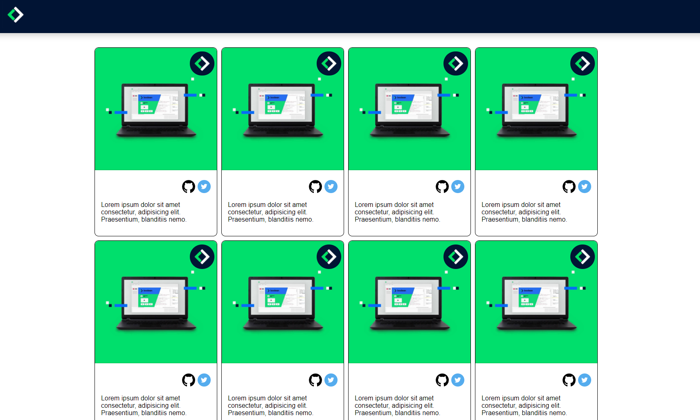

# Image Grid
Today we're recreating a grid of cards. You'll have the opportunity to implement and style images. The final result should look like this:

## Instructions
- Create a 16 card grid, each card includes:
	- A main image with (found in the assets folder)
	- A set of social media icons
	- A paragraph of text (lorem ipsum)
- The header section should stay fixed at the top
- It should have a footer section of the same size and colour as the header
- **Make sure the grid is responsive** - when the window is resized downwards, the number of cards displayed in a single row should be reduced.
	
## Tips
- Use grid to get the right layout in the card grid
- You'll find an assets folder in the template, use the images in it
- Don't forget to use what you've learned from the box model to position items inside the card

## Challenge 1
- Add a hero section before the grid section. You'll find an image you can use in the assets folder

## Challenge 2
- Create a second page that will be linked to each card. This is called a detail page
and should contain the same image as the card, plus some other descriptive content.
- It should have as well the same header and proper navigation in between pages.

## Challenge 3
- Add a logo in the top right corner of each card (found in the assets folder)
